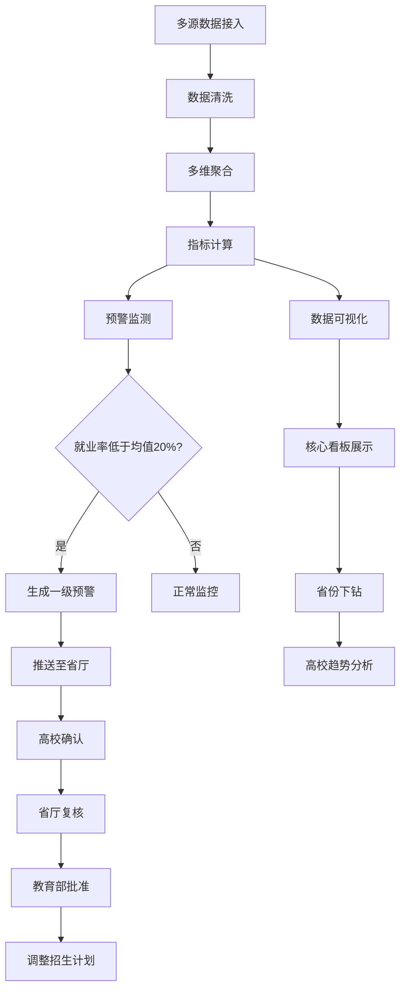

## 1. 产品概述

全国性高等教育教学质量与就业智能分析平台，实时接入多源教育数据，通过智能清洗与多维度聚合分析，为教育部、省级教育厅、高校三级用户提供教学质量监控、就业趋势分析、预警决策支持的一体化智能平台。

- 解决高等教育数据分散、质量监控滞后、就业预警不及时的痛点
- 目标用户：教育部、省级教育厅管理者、高校教务与就业部门
- 核心价值：数据驱动的教育决策科学化，提升人才培养质量与就业匹配度

---

## 2. 核心 Features

### 2.1 用户角色

| 角色 | 注册方式 | 核心权限 |
|------|----------|----------|
| 教育部用户 | 管理员分配 | 全国数据总览、审批招生计划调整、发布预警、查看所有报告 |
| 省厅用户 | 管理员分配 | 本省数据监控、复核预警申请、管理本省高校、生成本省报告 |
| 高校用户 | 管理员分配 | 本校数据管理、确认预警、上传培养方案、查看本校报告 |

### 2.2 Feature 模块

1. **登录认证页**：三级角色登录、权限验证、安全审计
2. **核心看板页**：全国招生热力图、就业排名、关键指标概览、预警统计
3. **数据详情页**：省份下钻、高校列表、历年趋势曲线、多维筛选
4. **预警中心页**：预警列表、预警详情、三级审批流程、审批状态追踪
5. **培养方案页**：Excel上传、课程自动提取、培养方案比对、异常提醒
6. **报告中心页**：报告列表、自动生成报告、报告下载、历史报告查询
7. **数据接入页**：数据源配置、数据导入、清洗规则配置、数据质量监控

### 2.3 页面详情

| 页面名称 | 模块名称 | Feature 描述 |
|----------|----------|-------------|
| 登录认证页 | 登录表单 | 账号密码登录、角色选择、验证码、记住登录状态 |
| 登录认证页 | 安全校验 | 密码强度验证、登录失败次数限制、会话超时管理 |
| 核心看板页 | 指标概览卡片 | 报到率、课程通过率、毕业率、初次就业率、专业对口率五大核心指标全国均值与同比 |
| 核心看板页 | 全国招生热力图 | ECharts中国地图，按省份展示招生规模热力，支持点击下钻 |
| 核心看板页 | 就业排名榜 | 学科/省份/高校维度就业排名，支持切换排序方式 |
| 核心看板页 | 预警统计面板 | 各级预警数量、待审批数量、近30天预警趋势 |
| 核心看板页 | 快捷操作区 | 最新预警提醒、待办审批、最新报告入口 |
| 数据详情页 | 省份筛选器 | 省份选择、学科筛选、学校层次筛选、年份区间选择 |
| 数据详情页 | 高校列表 | 本省高校列表，关键指标展示，支持排序和搜索 |
| 数据详情页 | 趋势曲线 | 历年指标趋势对比，多高校同图对比，数据导出 |
| 数据详情页 | 指标详情表格 | 各高校详细指标数据，支持列筛选、排序、导出Excel |
| 预警中心页 | 预警列表 | 分级别（一级/二级/三级）预警列表，支持多条件筛选 |
| 预警中心页 | 预警详情 | 预警原因分析、历史数据对比、建议措施、相关高校列表 |
| 预警中心页 | 审批流程 | 高校确认→省厅复核→教育部批准三级流转，审批意见填写 |
| 预警中心页 | 审批记录 | 完整审批历史、操作人、操作时间、审批意见 |
| 培养方案页 | Excel上传 | 拖拽上传、模板下载、上传进度、格式校验 |
| 培养方案页 | 课程提取 | 自动识别核心课程、学分要求、课时分布 |
| 培养方案页 | 比对分析 | 计划课程与实际开设课程比对，偏差率计算 |
| 培养方案页 | 异常提醒 | 偏差超15%自动提醒，异常详情展示，整改建议 |
| 报告中心页 | 报告概览 | 本周报告、历史报告、报告生成状态、报告类型统计 |
| 报告中心页 | 报告预览 | 在线预览报告内容，包含图表和数据表格 |
| 报告中心页 | 报告下载 | PDF/Excel格式下载，批量导出 |
| 报告中心页 | 报告配置 | 报告内容配置、生成周期设置、收件人配置 |
| 数据接入页 | 数据源管理 | 招生/报到/成绩/毕业/就业数据源配置 |
| 数据接入页 | 数据导入 | 手动导入、自动同步配置、导入日志 |
| 数据接入页 | 清洗规则 | 字段映射、去重规则、缺失值处理、异常值过滤 |
| 数据接入页 | 质量监控 | 数据完整性、准确性、时效性监控指标 |

---

## 3. 核心流程

### 3.1 数据处理流程

数据源实时接入 → 数据自动清洗（去重/补全/校验） → 多维度聚合（省份/学科/学校层次） → 指标计算（报到率/通过率/毕业率/就业率/对口率） → 数据存储与可视化

### 3.2 预警与审批流程

就业率连续两年低于全国均值20% → 系统自动生成一级预警 → 推送至省级教育厅 → 高校确认（7天内） → 省厅复核（5天内） → 教育部批准（5天内） → 调整招生计划 → 执行与跟踪

### 3.3 培养方案比对流程

上传培养方案Excel → 系统自动解析提取核心课程 → 与实际开课数据比对 → 计算偏差率 → 偏差>15%生成异常提醒 → 高校查看并整改 → 重新比对验证

### 3.4 流程图

---

## 4. 用户界面设计

### 4.1 设计风格

- **主色调**：深蓝色系（#165DFF）代表专业与权威，搭配科技感的亮青色（#0FC6C2）作为点缀
- **辅助色**：橙色（#FF7D00）用于预警提醒，绿色（#00B42A）表示正常，红色（#F53F3F）表示严重预警
- **背景色**：采用深色背景（#0E1428）搭配渐变效果，营造数据大屏的科技感与沉浸感
- **字体**：主标题使用「思源黑体 Bold」，正文使用「思源黑体 Regular」，数字使用等宽字体提升可读性
- **按钮风格**：圆角8px，悬停微动效，主要按钮带渐变边框
- **卡片风格**：半透明玻璃态效果，细边框，柔和阴影，悬浮时轻微上浮

### 4.2 页面设计概览

| 页面名称 | 模块名称 | UI 元素 |
|----------|----------|---------|
| 核心看板页 | 指标概览卡片 | 深色玻璃态卡片，数字跳动动画，环比趋势箭头，渐变边框 |
| 核心看板页 | 全国招生热力图 | 深蓝色底图，省份热力渐变，悬停显示详情，点击下钻动效 |
| 核心看板页 | 就业排名榜 | 榜单样式，前三名特殊高亮，滚动动画，切换Tab动效 |
| 核心看板页 | 预警统计面板 | 环形进度图，预警级别颜色区分，闪烁提醒动效 |
| 数据详情页 | 趋势曲线 | 平滑曲线图，多色图例，数据点悬停详情，区域选择缩放 |
| 数据详情页 | 高校列表 | 斑马纹表格，指标颜色标识，排序图标，行悬浮高亮 |
| 预警中心页 | 审批流程 | 时间轴样式，节点状态颜色，审批进度条，流转动画 |
| 培养方案页 | 比对分析 | 双向对比条形图，偏差率颜色刻度，异常项高亮标记 |
| 报告中心页 | 报告预览 | 仿PDF页面样式，分页导航，图表可交互 |

### 4.3 动效设计

- 页面加载：核心指标数字从0滚动到目标值，卡片依次淡入（staggered animation）
- 数据刷新：图表平滑过渡，新数据点闪烁提示
- 交互反馈：按钮点击缩放，卡片悬浮上浮+阴影加深，Tab切换滑动过渡
- 预警提醒：严重预警图标脉冲闪烁，通知横幅滑入

### 4.4 响应式设计

- 桌面端（1920px+）：充分利用大屏空间，多模块并排展示
- 平板端（1024-1920px）：调整布局，热力图保持完整，侧边栏可折叠
- 移动端（<1024px）：单列布局，核心指标优先展示，图表支持触控缩放

---

## 5. 非功能需求

### 5.1 性能要求
- 首屏加载时间 < 3秒
- 热力图渲染 < 1秒
- 数据查询响应 < 500ms
- 支持1000+并发用户

### 5.2 安全要求
- 三级权限严格隔离
- 敏感数据加密传输与存储
- 操作日志完整可追溯
- 会话超时自动登出

### 5.3 数据要求
- 支持每日千万级数据处理
- 数据备份与恢复机制
- 数据血缘可追溯
