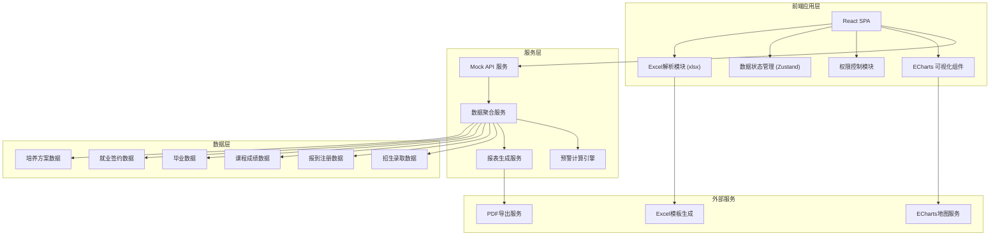
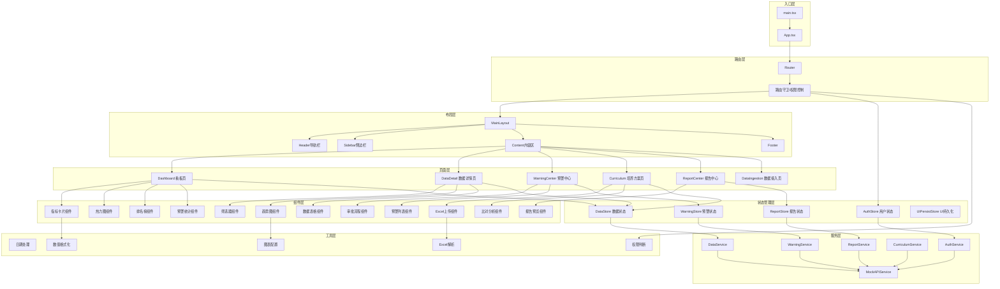
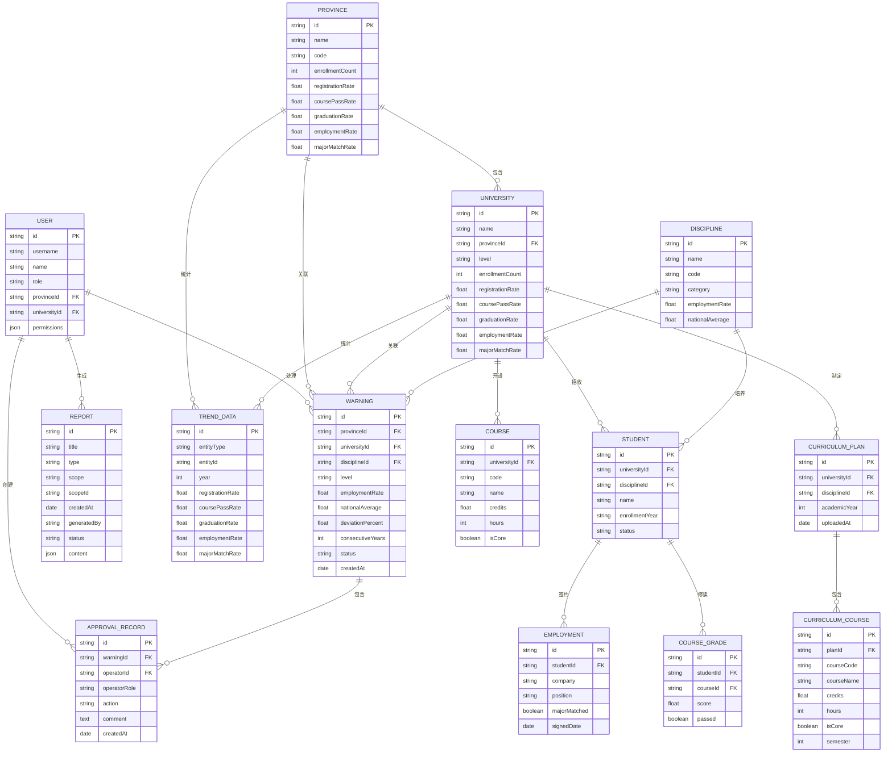

## 1. 架构设计



---

## 2. 技术描述

### 2.1 前端技术栈
- **框架**: React@18 + TypeScript
- **构建工具**: Vite@5
- **样式方案**: TailwindCSS@3 + CSS Variables
- **状态管理**: Zustand@4
- **路由管理**: React Router@6
- **图表可视化**: ECharts@5 + echarts-for-react
- **UI组件库**: Ant Design@5（按需加载）
- **Excel处理**: xlsx@0.18
- **动画库**: framer-motion@11
- **工具库**: dayjs, lodash-es, numeral

### 2.2 后端服务（Mock）
- **数据模拟**: Mock 数据 + localStorage 持久化
- **API 设计**: RESTful API 风格
- **数据聚合**: 前端计算引擎（用户侧聚合）

### 2.3 项目初始化
```bash
npm create vite@latest higher-education-analytics -- --template react-ts
cd higher-education-analytics
npm install
```

---

## 3. 路由定义

| Route | 页面名称 | 权限要求 | 说明 |
|-------|---------|---------|------|
| /login | 登录页 | 公开 | 三级角色登录入口 |
| /dashboard | 核心看板 | 所有角色 | 全国招生热力图、就业排名、指标概览 |
| /data/province/:provinceId | 省份详情 | 所有角色 | 省份下钻，高校列表，历年趋势 |
| /data/university/:universityId | 高校详情 | 高校/省厅/教育部 | 单校详细数据分析 |
| /warnings | 预警中心 | 所有角色 | 预警列表、预警详情、审批流程 |
| /warnings/:warningId | 预警详情 | 所有角色 | 预警详情与审批操作 |
| /curriculum | 培养方案 | 高校/省厅/教育部 | Excel上传、课程比对、异常提醒 |
| /reports | 报告中心 | 所有角色 | 报告列表、预览、下载、配置 |
| /data-ingestion | 数据接入 | 省厅/教育部 | 数据源管理、数据导入、清洗规则 |
| /settings | 系统设置 | 管理员 | 用户管理、权限配置、系统参数 |

---

## 4. API 定义（TypeScript 类型）

### 4.1 核心数据类型

```typescript
// 用户角色类型
type UserRole = 'ministry' | 'provincial' | 'university';

// 用户信息
interface User {
  id: string;
  username: string;
  name: string;
  role: UserRole;
  provinceId?: string;
  universityId?: string;
  permissions: string[];
}

// 省份数据
interface Province {
  id: string;
  name: string;
  code: string;
  enrollmentCount: number;
  registrationRate: number;
  coursePassRate: number;
  graduationRate: number;
  employmentRate: number;
  majorMatchRate: number;
}

// 高校数据
interface University {
  id: string;
  name: string;
  provinceId: string;
  level: '985' | '211' | 'double-first-class' | 'general';
  enrollmentCount: number;
  registrationRate: number;
  coursePassRate: number;
  graduationRate: number;
  employmentRate: number;
  majorMatchRate: number;
}

// 学科数据
interface Discipline {
  id: string;
  name: string;
  code: string;
  category: string;
  employmentRate: number;
  nationalAverage: number;
}

// 历年趋势数据
interface TrendData {
  year: number;
  registrationRate: number;
  coursePassRate: number;
  graduationRate: number;
  employmentRate: number;
  majorMatchRate: number;
}

// 预警数据
type WarningLevel = 'level1' | 'level2' | 'level3';
type ApprovalStatus = 'pending_university' | 'pending_provincial' | 'pending_ministry' | 'approved' | 'rejected';

interface Warning {
  id: string;
  provinceId: string;
  universityId: string;
  disciplineId: string;
  level: WarningLevel;
  employmentRate: number;
  nationalAverage: number;
  deviationPercent: number;
  consecutiveYears: number;
  status: ApprovalStatus;
  createdAt: string;
  approvalHistory: ApprovalRecord[];
}

interface ApprovalRecord {
  id: string;
  warningId: string;
  operatorId: string;
  operatorName: string;
  operatorRole: UserRole;
  action: 'confirm' | 'review' | 'approve' | 'reject';
  comment: string;
  createdAt: string;
}

// 培养方案课程
interface Course {
  id: string;
  code: string;
  name: string;
  credits: number;
  hours: number;
  isCore: boolean;
  semester: number;
}

interface CurriculumComparison {
  plannedCourses: Course[];
  actualCourses: Course[];
  deviationRate: number;
  anomalies: CurriculumAnomaly[];
}

interface CurriculumAnomaly {
  courseId: string;
  courseName: string;
  anomalyType: 'missing' | 'extra' | 'credit_deviation' | 'hour_deviation';
  deviationPercent: number;
  description: string;
}

// 报告数据
interface Report {
  id: string;
  title: string;
  type: 'weekly' | 'monthly' | 'quarterly' | 'custom';
  scope: 'national' | 'provincial' | 'university';
  scopeId?: string;
  createdAt: string;
  generatedBy: string;
  status: 'generating' | 'ready' | 'failed';
  content: ReportContent;
}

interface ReportContent {
  registrationRateYoY: number;
  coursePassRate: number;
  employmentDistribution: EmploymentDistributionItem[];
  keyMetrics: KeyMetric[];
  trends: TrendData[];
}

interface EmploymentDistributionItem {
  category: string;
  count: number;
  percentage: number;
}

interface KeyMetric {
  name: string;
  value: number;
  target: number;
  trend: 'up' | 'down' | 'stable';
}
```

### 4.2 API 接口定义

```typescript
// 认证接口
interface AuthAPI {
  login(username: string, password: string, role: UserRole): Promise<{ token: string; user: User }>;
  logout(): Promise<void>;
  getCurrentUser(): Promise<User>;
}

// 数据查询接口
interface DataAPI {
  getProvinces(filters?: DataFilters): Promise<Province[]>;
  getProvinceDetail(provinceId: string): Promise<Province & { universities: University[]; trends: TrendData[] }>;
  getUniversities(provinceId?: string, filters?: DataFilters): Promise<University[]>;
  getUniversityDetail(universityId: string): Promise<University & { trends: TrendData[]; disciplines: Discipline[] }>;
  getDisciplines(filters?: DataFilters): Promise<Discipline[]>;
  getEmploymentRanking(type: 'discipline' | 'province' | 'university', limit?: number): Promise<RankingItem[]>;
  getHeatmapData(): Promise<HeatmapItem[]>;
}

// 预警接口
interface WarningAPI {
  getWarnings(filters?: WarningFilters): Promise<Warning[]>;
  getWarningDetail(warningId: string): Promise<Warning>;
  universityConfirm(warningId: string, comment: string): Promise<Warning>;
  provincialReview(warningId: string, approved: boolean, comment: string): Promise<Warning>;
  ministryApprove(warningId: string, approved: boolean, comment: string, enrollmentAdjustment?: number): Promise<Warning>;
}

// 培养方案接口
interface CurriculumAPI {
  uploadCurriculum(file: File, universityId: string): Promise<CurriculumComparison>;
  getComparisonHistory(universityId: string): Promise<CurriculumComparison[]>;
  downloadTemplate(): Promise<Blob>;
}

// 报告接口
interface ReportAPI {
  getReports(filters?: ReportFilters): Promise<Report[]>;
  getReportDetail(reportId: string): Promise<Report>;
  generateReport(config: ReportConfig): Promise<Report>;
  downloadReport(reportId: string, format: 'pdf' | 'excel'): Promise<Blob>;
  getWeeklyReport(scope: string, scopeId?: string): Promise<Report>;
}

// 数据接入接口
interface DataIngestionAPI {
  getDataSources(): Promise<DataSource[]>;
  importData(sourceId: string, file?: File): Promise<ImportResult>;
  getImportHistory(): Promise<ImportRecord[]>;
  getCleaningRules(): Promise<CleaningRule[]>;
  getDataQualityMetrics(): Promise<DataQualityMetrics>;
}
```

---

## 5. 前端模块架构图



---

## 6. 数据模型

### 6.1 ER 图



### 6.2 Mock 数据结构说明

**数据存储策略**：
- 使用 localStorage 作为持久化存储
- 首次加载时生成模拟数据并缓存
- 数据更新时同步更新 localStorage
- 数据量控制在合理范围（约20MB以内）

**模拟数据规模**：
- 34个省级行政区
- 约120所高校（每省3-5所）
- 100+学科专业
- 历年数据：2018-2025年
- 预警数据：约200条，包含不同审批状态
- 报告数据：近一年周报、月报

---

## 7. 关键算法

### 7.1 核心指标计算公式

```typescript
// 报到率
const registrationRate = (actualRegistrations / plannedEnrollments) * 100;

// 课程通过率
const coursePassRate = (passedStudents / totalStudents) * 100;

// 毕业率
const graduationRate = (graduatedStudents / eligibleStudents) * 100;

// 初次就业率
const initialEmploymentRate = (employedStudents / totalGraduates) * 100;

// 专业对口率
const majorMatchRate = (majorMatchedStudents / employedStudents) * 100;
```

### 7.2 预警检测算法

```typescript
function detectWarning(disciplineId: string, years: number = 2): Warning | null {
  const trendData = getDisciplineTrend(disciplineId, years);
  const nationalAverage = getNationalEmploymentAverage();
  const consecutiveYears = countConsecutiveLowEmployment(trendData, nationalAverage);
  
  if (consecutiveYears >= 2) {
    const latestRate = trendData[trendData.length - 1].employmentRate;
    const deviationPercent = ((nationalAverage - latestRate) / nationalAverage) * 100;
    
    if (deviationPercent >= 20) {
      return {
        id: generateId(),
        level: 'level1',
        employmentRate: latestRate,
        nationalAverage,
        deviationPercent,
        consecutiveYears,
        status: 'pending_university',
        createdAt: new Date().toISOString(),
        approvalHistory: []
      };
    }
  }
  return null;
}
```

### 7.3 培养方案比对算法

```typescript
function compareCurriculum(
  plannedCourses: Course[],
  actualCourses: Course[]
): CurriculumComparison {
  const anomalies: CurriculumAnomaly[] = [];
  let deviationCount = 0;
  
  const plannedMap = new Map(plannedCourses.map(c => [c.code, c]));
  const actualMap = new Map(actualCourses.map(c => [c.code, c]));
  
  // 检查缺失课程
  plannedCourses.forEach(pc => {
    if (!actualMap.has(pc.code) && pc.isCore) {
      anomalies.push({
        courseId: pc.id,
        courseName: pc.name,
        anomalyType: 'missing',
        deviationPercent: 100,
        description: `核心课程「${pc.name}」未开设`
      });
      deviationCount++;
    }
  });
  
  // 检查额外课程
  actualCourses.forEach(ac => {
    if (!plannedMap.has(ac.code)) {
      anomalies.push({
        courseId: ac.id,
        courseName: ac.name,
        anomalyType: 'extra',
        deviationPercent: 50,
        description: `计划外课程「${ac.name}」被开设`
      });
      deviationCount++;
    }
  });
  
  // 检查学分/课时偏差
  plannedCourses.forEach(pc => {
    const ac = actualMap.get(pc.code);
    if (ac) {
      const creditDeviation = Math.abs(pc.credits - ac.credits) / pc.credits * 100;
      const hourDeviation = Math.abs(pc.hours - ac.hours) / pc.hours * 100;
      
      if (creditDeviation > 15) {
        anomalies.push({
          courseId: pc.id,
          courseName: pc.name,
          anomalyType: 'credit_deviation',
          deviationPercent: creditDeviation,
          description: `「${pc.name}」学分偏差${creditDeviation.toFixed(1)}%，计划${pc.credits}学分，实际${ac.credits}学分`
        });
        deviationCount++;
      }
      
      if (hourDeviation > 15) {
        anomalies.push({
          courseId: pc.id,
          courseName: pc.name,
          anomalyType: 'hour_deviation',
          deviationPercent: hourDeviation,
          description: `「${pc.name}」课时偏差${hourDeviation.toFixed(1)}%，计划${pc.hours}课时，实际${ac.hours}课时`
        });
        deviationCount++;
      }
    }
  });
  
  const totalCourses = plannedCourses.length + actualCourses.length;
  const deviationRate = (deviationCount / totalCourses) * 100;
  
  return {
    plannedCourses,
    actualCourses,
    deviationRate,
    anomalies
  };
}
```

### 7.4 自动报告生成算法

```typescript
function generateWeeklyReport(scope: string, scopeId?: string): Report {
  const data = fetchWeeklyData(scope, scopeId);
  
  const content: ReportContent = {
    registrationRateYoY: calculateYoY(data.currentWeek.registrationRate, data.lastYear.registrationRate),
    coursePassRate: data.currentWeek.coursePassRate,
    employmentDistribution: calculateEmploymentDistribution(data.currentWeek.employments),
    keyMetrics: calculateKeyMetrics(data),
    trends: aggregateTrendData(data.trends)
  };
  
  return {
    id: generateId(),
    title: `${getScopeName(scope, scopeId)}教学质量诊断周报`,
    type: 'weekly',
    scope,
    scopeId,
    createdAt: new Date().toISOString(),
    generatedBy: 'system',
    status: 'ready',
    content
  };
}
```
